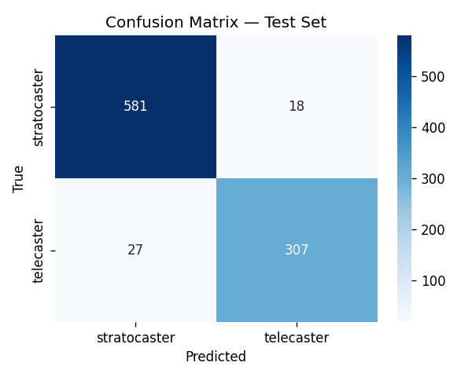
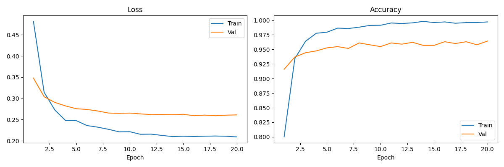
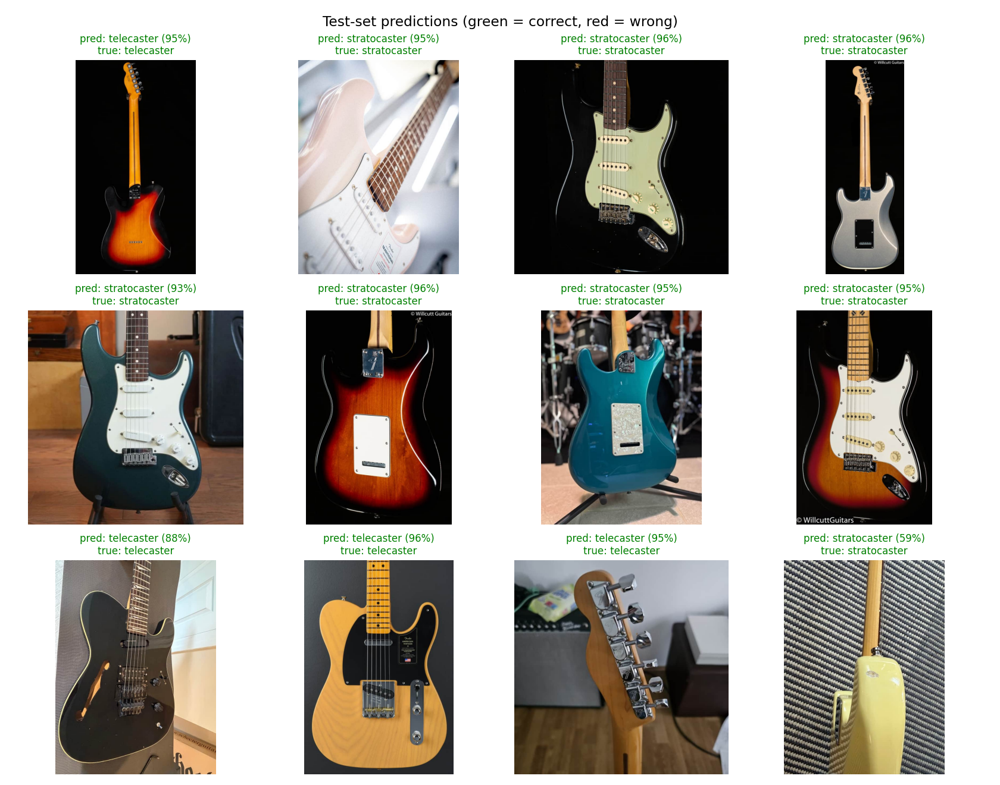

# Visual Identification of Electric Guitars

Classify a guitar listing photo into its model with a convolutional neural
network. This repo trains an EfficientNet-B0 image classifier on pulled
[Reverb](https://reverb.com) marketplace listings and, in its current form,
distinguishes a Fender Stratocaster from a Fender Telecaster from a single photo.

Original proposal: [`PROPOSAL.md`](PROPOSAL.md).

## Project purpose

This project classifies a guitar listing photo by model. In its current form it
distinguishes a Fender Stratocaster from a Telecaster using a CNN trained on pulled
Reverb listings. Reverb is an online maketplace where stores and individuals can post 
music related equipment to an online market. 

## Scope vs. the proposal

My original proposal aimed to identify make, model, and year. Two scope decisions, both
driven by the data:

- Year was dropped. Only about 44% of scraped listings carried a usable year, and
  many were vague (`"2000s?"`, `"early 60s"`)
- Narrowed to two classes (Stratocaster vs. Telecaster), although the
  model scales to N classes. A 5-class set (`les_paul`, `sg`, `es_335`)
  is the natural next step, however I ran out of API credits...

## The dataset and how it was built

I wanted to gain expereince pulling data using an API, and pull real listings from 
Reverb.com. The pipeline is reproducible from the code in `src/`:

1. Scrape (`scraping/scrape.py`, `strat-scrape`): per-model queries against Reverb
   via the Apify API, restricted to `categorySlug=electric-guitars`, deduplicated
   by listing `id`, paginated until dry. Raw exports are saved to `data/json/`.
2. Label from metadata (`scraping/prepare.py`, `strat-prepare`): each listing is
   labeled by model, read from its structured `make`/`model`/`title` fields rather
   than keyword guessing. A listing is kept only if it comes from an allowed brand,
   matches exactly one canonical model, is not a parts/accessory listing
   (a bunch of photos were these), and is priced at least $150 (mainly to avoid parts).
3. Download images: up to 5 photos per listing into
   `data/images_labeled/<model>/<listing_id>_<idx>.jpg`. The `<listing_id>_`
   filename prefix is what the group-aware split keys on.

### Final counts

| Class | Listings | Images |
|---|---:|---:|
| stratocaster | 862 | 3,982 |
| telecaster | 471 | 2,213 |
| **Total** | **1,333** | **6,195** |

Group-aware split by listing (seed 42): 933 train / 200 val / 200 test listings
(4,310 / 952 / 933 images). From an initial pull of ~1,611 unique listings,
labeling kept 1,333 and dropped 278 (104 too cheap, 102 parts, 71 wrong-brand, 1
ambiguous). The classes are unfortunately imbalanced (more Strats than Teles),
a result of maxing out API credits. A `WeightedRandomSampler` on the training set 
aims to compensate for this. Stats are regenerated with 
`python -m strat_classifier.stats`.

### Why the split is grouped by listing

Each listing contributes up to 5 near-duplicate photos of the same guitar against
the same background. A per-image split would put photos of one guitar in both
train and test and inflate accuracy. The split in `data.py` instead groups on
`listing_id` so every photo of one listing stays in a single split, stratified per
class, with an assertion guarding against any listing appearing in more than one
split. If a new data set could be generated, only 1 photo per listing would be 
pulled. Since timing and funds didn't allow for this, grouping by listing made 
sense. 

## How to train

```bash
pip install -e .          # installs the package + console scripts
strat-train               # trains, evaluates, writes models/ + results/
```

Useful flags: `strat-train --epochs 20 --batch-size 32 --lr 1e-4`. Training builds
the group-aware, stratified 70/15/15 loaders (with the `WeightedRandomSampler` on
train), fine-tunes EfficientNet-B0 (ImageNet-pretrained) with an N-way head, AdamW,
a cosine LR schedule, and `label_smoothing=0.1`, then saves the best-by-val
checkpoint to `models/best_model.pt`, the class ordering to
`models/class_names.json`, and writes `results/confusion_matrix.png` and
`results/training_curves.png`.

To rebuild the dataset from scratch first, run `strat-scrape` (needs `APIFY_TOKEN`)
then `strat-prepare`. The labeled dataset and metadata are committed, so a fresh
clone can run `pip install -e . && strat-train` without re-scraping. Predict on a
single image with `strat-predict path/to/guitar.jpg`.

## Results

Trained 20 epochs on an Apple-Silicon GPU (MPS) and evaluated on the held-out,
group-aware test split (933 images / 200 listings).

| Metric | Value |
|---|---:|
| Test accuracy | 95.2% |
| Majority-class baseline | 64.2% (always "stratocaster") |
| Macro-average F1 | 0.95 |

Per-class (test set):

| Class | Precision | Recall | F1 | Support |
|---|---:|---:|---:|---:|
| stratocaster | 0.96 | 0.97 | 0.96 | 599 |
| telecaster | 0.94 | 0.92 | 0.93 | 334 |





### Prediction visualization

A grid of test images with the predicted model and the model's confidence 
(green = correct, red = wrong):



## Limitations

This is a two-class, single-brand-family classifier, and Strat vs. Tele is a
visually obvious distinction, so accuracy will drop as look-alike models (Gibson
vs. Epiphone Les Paul, Jazzmaster vs. Jaguar) are added. Labels come from
seller-entered `make`/`model` fields, which are cleaner than keyword guessing but
not always perfect. 

## Repository layout

| Path | Purpose |
|---|---|
| `src/strat_classifier/model.py` | EfficientNet-B0 model definition |
| `src/strat_classifier/data.py` | dataset class, group-aware split, dataloaders |
| `src/strat_classifier/train.py` | training loop, evaluation, plots |
| `src/strat_classifier/inference.py` | single-image prediction |
| `src/strat_classifier/scraping/` | scrape + metadata labeling pipeline |
| `notebooks/milestone_dataloader.ipynb` | dataset examples via `make_dataloaders` |
| `notebooks/evaluation.ipynb` | test-set metrics + prediction grid |
| `models/best_model.pt`, `class_names.json` | trained weights + class ordering |
| `data/images_labeled/`, `data/json/` | labeled dataset + raw metadata |

`model.py`, `data.py`, and `train.py` correspond to the assignment's `models.py`,
`dataset.py`, and `train_models.py`. Weights and the labeled dataset are committed,
so the notebooks run on a fresh clone.
